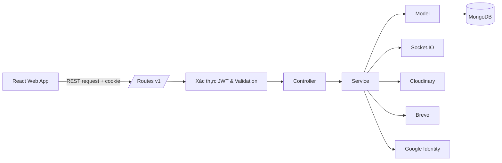
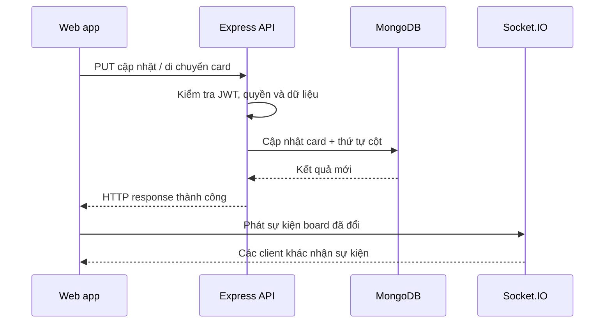

# Trello Pro API

> Backend Node.js/Express độc lập, cung cấp REST API, xác thực cookie an toàn và Socket.IO cho Trello Pro.

Mã nguồn được tổ chức theo route → controller → service → model để tách HTTP layer, nghiệp vụ và truy cập MongoDB.

## API này phục vụ điều gì?

API là “bộ điều phối” phía sau ứng dụng Trello Pro. Nó nhận yêu cầu từ frontend, xác minh người dùng là ai, kiểm tra họ có quyền trên board hay không, lưu thay đổi vào MongoDB và gửi sự kiện để những người cùng cộng tác được cập nhật.

Ví dụ, khi người dùng kéo một card sang cột khác, API không chỉ đổi vị trí card: nó còn cập nhật thứ tự card ở hai cột liên quan, kiểm tra quyền truy cập và phát tín hiệu Socket.IO cho các client khác.

## Bức tranh kiến trúc



**Luồng một request:** Route chọn endpoint → middleware kiểm tra token/dữ liệu → controller điều phối → service thực thi nghiệp vụ → model đọc/ghi MongoDB → middleware lỗi chuẩn hoá phản hồi nếu có sự cố.

## Tính năng

- Đăng ký, xác minh email, đăng nhập email/mật khẩu và Google.
- JWT access/refresh token trong cookie `httpOnly`.
- CRUD board, column, card; duy trì thứ tự khi kéo card/cột.
- Phân quyền: chỉ owner hoặc member mới được truy cập board.
- Mời user vào board, nhận và phản hồi lời mời.
- Cập nhật hồ sơ, đổi mật khẩu, upload avatar/cover qua Cloudinary.
- Gửi mail xác minh qua Brevo.
- Validation Joi, CORS credentials, error handling tập trung và Socket.IO real-time.

## Một thay đổi card đi qua API như thế nào?



## Công nghệ

| Nhóm | Công nghệ |
| --- | --- |
| HTTP & runtime | Node.js, Express |
| Database | MongoDB Native Driver, Aggregation Pipeline |
| Bảo mật | JWT, bcryptjs, cookie-parser, CORS |
| Validation & upload | Joi, Multer, Streamifier |
| Real-time | Socket.IO |
| Dịch vụ ngoài | Google Auth Library, Cloudinary, Brevo |

## Cấu trúc mã nguồn

```text
src/
├── config/       # MongoDB, biến môi trường, CORS
├── routes/v1/    # Endpoint API version 1
├── controllers/  # Xử lý request/response
├── services/     # Nghiệp vụ và phân quyền
├── models/       # Schema/truy vấn MongoDB
├── validations/  # Joi validation
├── middlewares/  # JWT, upload, error handler
├── providers/    # JWT, Google, Cloudinary, Brevo
└── sockets/      # Sự kiện Socket.IO
```

## Cài đặt

Yêu cầu Node.js **18+**, MongoDB và các tài khoản Cloudinary/Brevo/Google OAuth nếu dùng tính năng liên quan.

```bash
npm install
```

Tạo `.env`:

```env
BUILD_MODE=dev
LOCAL_DEV_APP_HOST=localhost
LOCAL_DEV_APP_PORT=8017
MONGODB_URI=mongodb+srv://<username>:<password>@<cluster>/?retryWrites=true&w=majority
DATABASE_NAME=trello

ACCESS_TOKEN_SECRET_SIGNATURE=chuoi-bi-mat-dai-va-ngau-nhien
ACCESS_TOKEN_LIFE=15m
REFRESH_TOKEN_SECRET_SIGNATURE=chuoi-bi-mat-khac
REFRESH_TOKEN_LIFE=14d

GOOGLE_CLIENT_ID=google-client-id
CLOUDINARY_CLOUD_NAME=cloud-name
CLOUDINARY_API_KEY=api-key
CLOUDINARY_API_SECRET=api-secret
BREVO_API_KEY=brevo-api-key
ADMIN_EMAIL_ADDRESS=verified-sender@example.com
ADMIN_EMAIL_NAME=Trello Pro
```

Không commit `.env` hay khoá bí mật lên GitHub.

## Chạy ứng dụng

```bash
npm run dev
```

API chạy mặc định tại `http://localhost:8017` với prefix `/v1`.

```bash
npm run production
```

Lệnh production build Babel output và khởi chạy server theo biến môi trường production.

## API chính

| Nhóm | Endpoint |
| --- | --- |
| User | `POST /v1/users/register`, `PUT /v1/users/verify`, `PUT /v1/users/login`, `POST /v1/users/google-login`, `GET /v1/users/refresh_token`, `PUT /v1/users/update` |
| Board | `GET/POST /v1/boards`, `GET/PUT/DELETE /v1/boards/:id`, `PUT /v1/boards/supports/moving_card` |
| Column | `POST /v1/columns`, `PUT/DELETE /v1/columns/:id` |
| Card | `POST /v1/cards`, `PUT /v1/cards/:id` |
| Invitation | `POST /v1/invitations/board`, `GET /v1/invitations`, `PUT /v1/invitations/board/:invitationId` |

Các endpoint board/column/card/invitation yêu cầu access token hợp lệ trong cookie.

## Sự kiện Socket.IO

| Client phát | Server phát lại | Mục đích |
| --- | --- | --- |
| `FE_UPDATE_BOARD` | `BE_UPDATE_BOARD` | Các client khác tải lại board sau thay đổi |
| `FE_USER_INVITED_TO_BOARD` | `BE_USER_INVITED_TO_BOARD` | Báo lời mời board cho người nhận |

## Các quyết định kỹ thuật

- Cookie `httpOnly` ngăn JavaScript phía client đọc token trực tiếp.
- Refresh token tạo access token mới khi token cũ hết hạn.
- MongoDB aggregation trả board kèm columns, cards và thành viên; các trường nhạy cảm như password/verify token bị loại trừ.
- Joi kiểm tra request; các field không được phép cập nhật bị lọc trước khi ghi DB.
- Production CORS dùng allowlist và cho phép credentials.

## Kiểm tra mã nguồn

```bash
npm run lint
```
